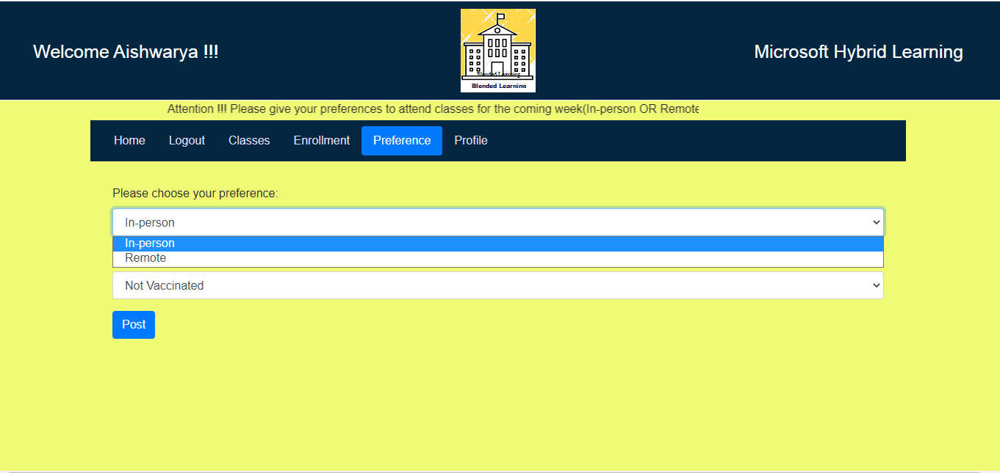
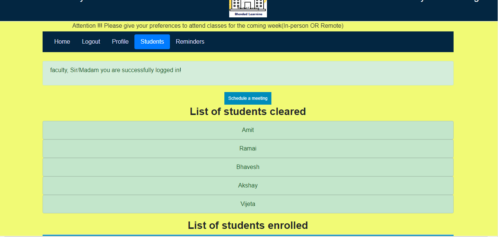

# 
Microsoft Hybrid Learning

## 
Convenient learning, this pandemic.

## Table of Contents 
- Setup and Installation 
- About the Challenge
- Agile development methodology
- Features
  	- Homepage
  	- Scheduler
  	- Reminder Functionality
- Admin
- Implementation Details
- Future Scope
- Gallery

# Setup and Installation
* Install MongoDB and MongoDB Compass(optional)
- Install Visual Studio Code

- git clone <"URL">

- pip install -r requirements.txt
- Activate virtual environment

- View the app on http://127.0.0.1:5000

# Microsoft Engage-2021
* The Challenge
	* Build a functional prototype of a platform that gives students an array of digital academic and social tools to stay engaged with their studies, peers and broader university community during pandemic.
	* This feature that allows students to submit weekly preferences for attending class in-person or remotely. The tool then assigns available seats to students who want to physically attend class and provides the faculty with a roster of who has been cleared to attend.
    * Using this tool, the faculty can distribute assignments, and upon receiving submissions from the students - analyze, and grade assignments. The tool could have other features such as test case creation, autograders, and static code analyzer integration.
    * Creating a classroom community where meaningful conversations can happen isn't easy - it's an ongoing process that takes time. Using online discussion tools can be a great way to help students build these skills. The tool could have a "moderation" feature to hold discussions responsibily.
	* Don't restrict your imagination with just these examples. We would love to see your unique idea when you create a product that that encourages greater collaboration and engagement in times of a pandemic, while also keeping students and staff safe.

# Agile development Methodology
*
* I planned weekly sprint for building this prototype. Identifies big tasks and added multiple subtasks.
* In the first week, After a lot of research on Technology stack, I chose to make a web app using Flask and Python 
* Database was the crucial part and focused on ER diagrams and table creation.
* In the second week, created user registration and login with database connectivity using MongoDb collections.
* In the third week, focused on implementing important/main features such as scheduling physical classes for those students who are enrolled in a course and wants to attend physical classes. The criteria to clear this was based on Pandemic situation.
* Also, focused on not neglecting students attending online classes parallely and created a feature of reminder for faculty to schedule a meeting.

# Features :
*
## Homepage
*
* Login/Register 
	* Users are of two types : Student, Faculty. Features of users are as follows:
        * Student : Register, Login, Give preference(wants to attend In-person and update vaccination status), Enroll a course of particular faculty
        * Faculty : Register, Login, Remove student enrolled in its class.
    * Login session to provide different features and trace user activities.
    * Covid-19 Guidelines page
* Validate user using flask sessions
* Logout
## Scheduler
*
* Student enrolls course. Student provides preference about In-person or remote attendance
* Get list of students enrolled to course offered by a faculty
* Verify with student preferences and COVID-19 criteria about reopening.
* COVID-19 criteria : Candidate must be fully vaccinated. Faculty should allow 50% of classroom capacity. Example: A classroom can have maximum 10 students, available seats = 5, if there are more students than available seats, students are  selected on the basis of FCFS.

* Faculty gets a list of students cleared the criteria

## Reminder Functionality
*
* Faculty gets a roster of cleared students but he may forget about students attending remotely, this feature helps create reminder for faculty for a selected duration 
* Faculty can tick off reminder if he scheduled a meeting for other students.

# Admin 
*
* Adds course data in monogodb collections

# Implementation Details
*
	* Tech Stacks Used:
		* Flask
		* MongoDB ( for Database )
		* Python
        * Jinja
		* HTML, CSS

# Future Work
*
* Add faculty-student meeting session
* Enhance UI/UX

# Gallery

| | | |
|:-------------------------:|:-------------------------:|:-------------------------:|
|  Homepage |   Login Profile| Login Validation|
| Courses |  Enrolled Courses| Student Preference|
|Create Reminder |   Scheduler | Enrolled Students for a Course|

